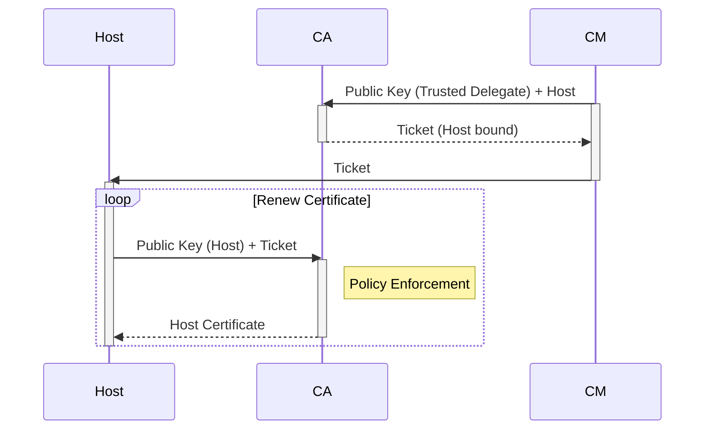
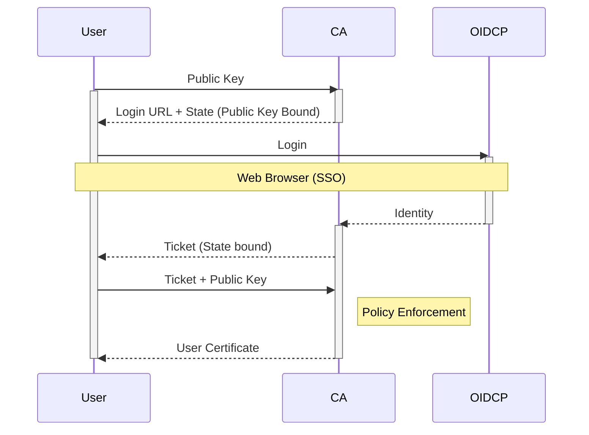

# Simple SSH CA

Simple SSH CA is a lightweight OpenSSH certificate authority written in golang.
Simple SSH CA can issue both _user_ and _host_ certificate types according to the [openssh specification](https://cvsweb.openbsd.org/src/usr.bin/ssh/PROTOCOL.certkeys?rev=1.8) using a policy-based authorization control.
Currently the following policy engines are supported.

- [Open Policy Agent](https://www.openpolicyagent.org/)

## Motivation

Using certificates for openssh is unarguably the safest way of handling ssh permissions.
But issuing OpenSSH Certificates are hard, especially with a dedicated certificate authority.
By creating an application that makes this process as simple and effective as possible will reduce the risk that the use of openssh certificate is ignored.

The key components for a simple yet effective openssh certificate implementation:

- The solution should be lightweight and stateless.
- Existing solutions should be used in order to distribute and authorize the access.
- The client and hosts should **not** require any additional cli or tools to be installed.

## How it works

### Host Certificates

### User Certificates

## Examples

- [Ansible](examples/ansible/README.md)