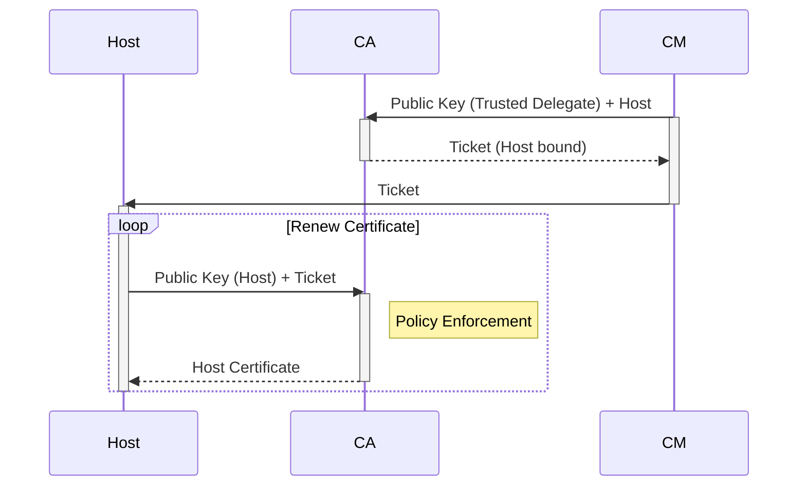
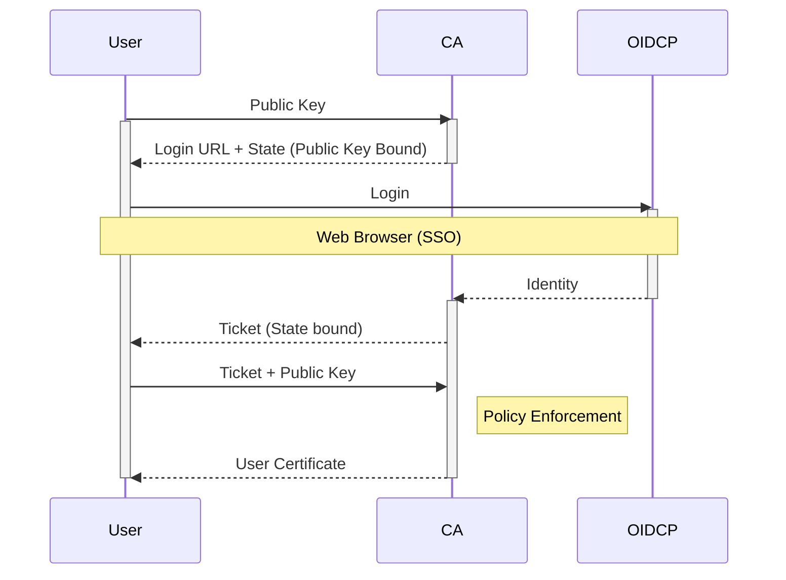

# PaC SSH CA

PaC (policy-as-code) SSH CA is a lightweight OpenSSH certificate authority written in golang.
PaC SSH CA can issue both _user_ and _host_ certificate types according to the [openssh specification](https://cvsweb.openbsd.org/src/usr.bin/ssh/PROTOCOL.certkeys?rev=1.8) using a policy-based authorization control.

Currently the following policy engines are supported.

- [Open Policy Agent](https://www.openpolicyagent.org/)

## Motivation

Using certificates for openssh is unarguably the safest way to handle ssh access and permissions.
But issuing certificates for ssh are often seen as hard and complicated, especially from a dedicated authority, which keeps certificates from even being introduced for ssh in the first place.
By creating an application that makes the process of issuing certificates for ssh as simple and effective as possible will reduce the risk of ignoring certificates for ssh.

The key components for a simple yet effective openssh certificate implementation:

- The solution should be lightweight, stateless and de-centralized for maximum availability and maintainability.
- Existing solutions should be used in order to distribute and authorize the access.
- The client and hosts should not require any additional cli or tools to be installed, hence the standard SSH protocol should be used as the central authority mechanism.

## How it works

PaC SSH CA works with the concept of `delegates` - delegating the signing of certificates to a list of trusted and known public-keys (delegates), and `tickets` - which can be used as proof to get public-keys (clients) signed by the authority.

Requesting a new ticket can be done by simply ssh to the certificate authority (PaC SSH CA). If the public-key presented by the client is not present in the list of trusted delegates a new federated login will be performed in order to identity the client as a trusted entity.

Even though PaC SSH CA can technically be runned in both "user" and "host" mode, for security reason they should be configured and operated seperatly.

### Host Certificates

### User Certificates

## Examples

- [Ansible](examples/ansible/README.md)