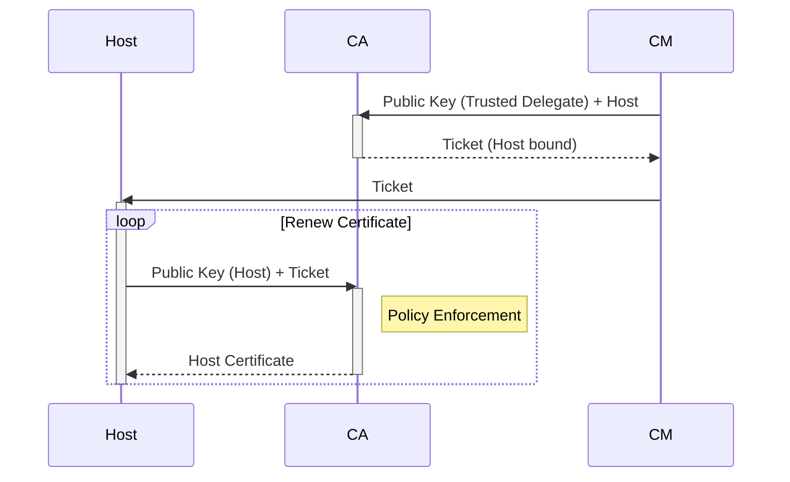
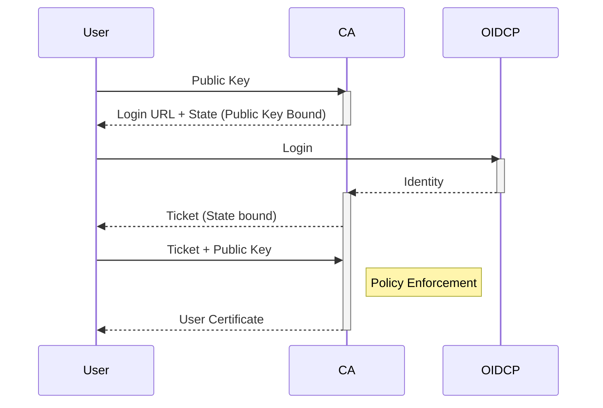

# WORK IN PROGRESS

## Issue Host Certificates

```mermaid
sequenceDiagram
    participant Host
    participant CA
    participant CM

    CM->>CA: Public Key (Trusted Delegate) + Host
    activate CA
    CA-->>CM: Ticket (Host bound)
    deactivate CA
    CM->>Host: Ticket
    activate Host
    loop Renew Certificate
        Host->>CA: Public Key (Host) + Ticket
        activate CA
        Note right of CA: Policy Enforcement
        CA-->>Host: Host Certificate
        deactivate CA
    end
    deactivate Host
```

## Issue User Certificates

```mermaid
sequenceDiagram
    participant User
    participant CA
    participant OIDCP

    User->>CA: Public Key
    activate CA
    CA-->>User: Login URL + State (Public Key Bound)
    deactivate CA
    User->>OIDCP: Login
    activate OIDCP
    OIDCP-->>CA: Identity
    deactivate OIDCP
    activate CA
    CA-->>User: Ticket (State bound)
    User->>CA: Ticket + Public Key
    Note right of CA: Policy Enforcement
    CA-->>User: User Certificate
    deactivate CA
```